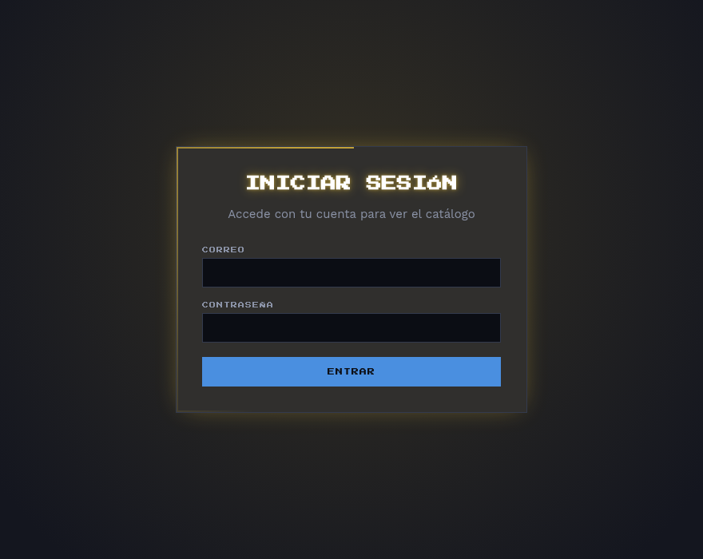
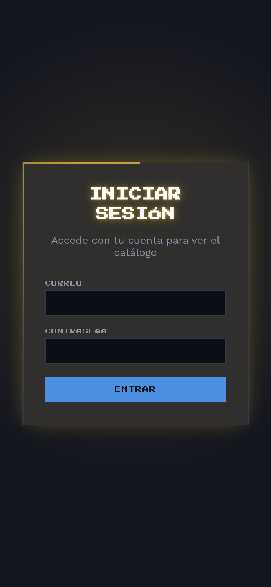
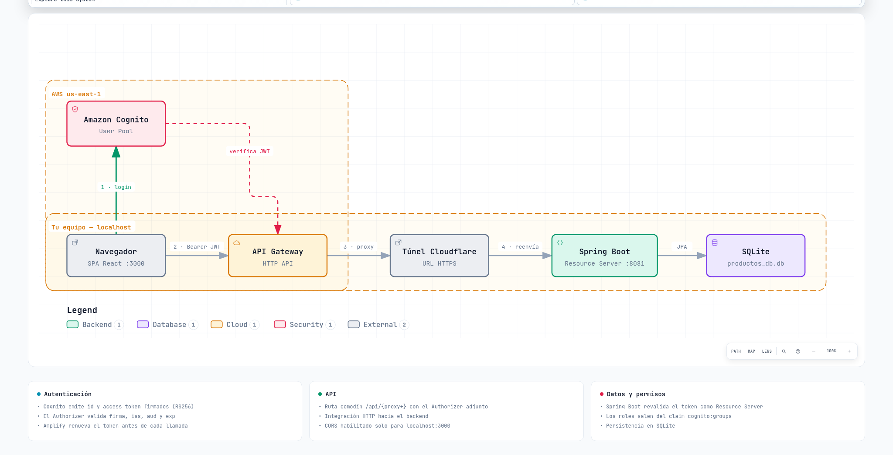

# PixelRig — Frontend

Tienda de componentes de PC. Este repositorio es la SPA en React: catálogo de productos, mantenedor de administración y contacto, autenticada contra **Amazon Cognito** y consumiendo el backend a través de un **API Gateway** que valida el token en la puerta.

El backend (Spring Boot + SQLite) vive en un repositorio aparte.



## Vistas

| Ruta | Vista | Quién entra | Qué hace |
| --- | --- | --- | --- |
| `/login` | Inicio de sesión | Público | Autentica contra Cognito y guarda la sesión |
| `/productos` | Catálogo | Usuarios autenticados | Lista los componentes por categoría y su stock |
| `/contacto` | Contacto | Usuarios autenticados | Formulario de contacto de la tienda |
| `/admin/productos` | Mantenedor | Solo `ADMIN` | Alta, edición y borrado sobre el catálogo |

Cualquier ruta desconocida redirige a `/productos`. La protección está en `ProtectedRoute`, que además de exigir sesión comprueba `usuario.grupos` contra los roles permitidos de la ruta.

### En móvil



## Stack

| Pieza | Versión | Por qué |
| --- | --- | --- |
| React | 19 | Composición por componentes para un catálogo con varias vistas |
| Vite | 8 | Servidor de desarrollo con recarga instantánea y build optimizado |
| React Router | 7 | Rutas anidadas, redirección y el guard de rol en una sola capa |
| Axios | 1.20 | Un interceptor de request centraliza el envío del token y el manejo de errores |
| AWS Amplify | 6.22 | Resuelve login, sesión y refresco de tokens sin escribir el flujo OAuth a mano |
| oxlint | 1.81 | Linter rápido, sin configuración |

## Cómo funciona



1. El usuario inicia sesión en Cognito desde el front. Amplify guarda los tokens y los refresca cuando expiran.
2. Cada llamada sale por `axiosClient`, que adjunta `Authorization: Bearer <id token>` antes de enviarla.
3. El API Gateway recibe la petición, valida firma, emisor, audiencia y expiración con su JWT Authorizer, y la reenvía al backend. Si el token no es válido responde `401` sin llegar a la aplicación.
4. El backend revalida el token como Resource Server y decide según el rol que viene en el claim `cognito:groups`.

La validación está repartida a propósito: el Gateway descarta el tráfico no autenticado en el borde, y los permisos por rol quedan en la aplicación, que es quien conoce el dominio.

`docs/diagramas/pixelrig-arquitectura.html` es la versión navegable del diagrama, con sus dos vistas guiadas, y `diagrama-oscuro.png` es la variante para tema oscuro.

## Estructura

| Ruta | Qué es |
| --- | --- |
| `src/main.jsx` | Punto de entrada: monta React y el `AuthProvider` |
| `src/App.jsx` | Definición de rutas y layout con la barra de navegación |
| `src/views/Login.jsx` | Formulario de acceso contra Cognito |
| `src/views/Productos.jsx` | Catálogo agrupado por categoría, con aviso de stock bajo |
| `src/views/AdminProductos.jsx` | Mantenedor: crear, editar y eliminar productos |
| `src/views/Contacto.jsx` | Formulario de contacto |
| `src/components/Navbar.jsx` | Barra superior; muestra el mantenedor solo a `ADMIN` |
| `src/components/ProtectedRoute.jsx` | Exige sesión y rol antes de renderizar la vista |
| `src/context/AuthContext.jsx` | Estado de sesión, usuario y grupos, sobre Amplify |
| `src/api/axiosClient.js` | Cliente HTTP: URL base del Gateway e interceptor del token |
| `src/config/cognito.js` | Configuración del User Pool y del App Client |
| `src/styles/tokens.css` | Variables de diseño: colores, tipografías y espaciados |
| `src/styles/global.css` | Estilos de las vistas |
| `docs/diagramas/` | Diagrama de arquitectura en PNG y HTML navegable |
| `docs/capturas/` | Capturas de pantalla usadas en este README |

## Cómo ejecutarlo

Requiere Node 20 o superior y el backend en ejecución, local o expuesto tras el Gateway.

```bash
npm install
npm run dev     # http://localhost:3000
```

| Comando | Qué hace |
| --- | --- |
| `npm run dev` | Servidor de desarrollo en el puerto 3000 |
| `npm run build` | Build de producción en `dist/` |
| `npm run preview` | Sirve el build para revisarlo |
| `npm run lint` | Revisa el código con oxlint |

Para apuntar a otro backend basta con cambiar la `baseURL` de `src/api/axiosClient.js`. Funciona tanto contra el API Gateway como contra el backend directo en `http://localhost:8081/api`.

## Configuración

La configuración de Cognito vive en `src/config/cognito.js`:

```js
Auth: {
  Cognito: {
    userPoolId: 'us-east-1_9ZxooRhyv',
    userPoolClientId: '62n42rgrii24pdg7j3ufe13scr',
    loginWith: { email: true },
  },
}
```

Estos dos identificadores son públicos por diseño: viajan en el bundle del navegador. No son credenciales y no permiten leer ni modificar datos por sí solos, porque todo endpoint exige un token válido. El App Client está configurado **sin secreto**, que es lo correcto para una SPA: un secreto embebido en el front no sería un secreto.

Los grupos del User Pool (`ADMIN`, `EDITOR`, `USER`) llegan al front dentro del claim `cognito:groups` y son los que alimentan `usuario.grupos`.

El interceptor envía el **id token**, no el access token: el Authorizer del Gateway valida la audiencia (`aud`) del token, y esa claim solo está presente en el id token.
